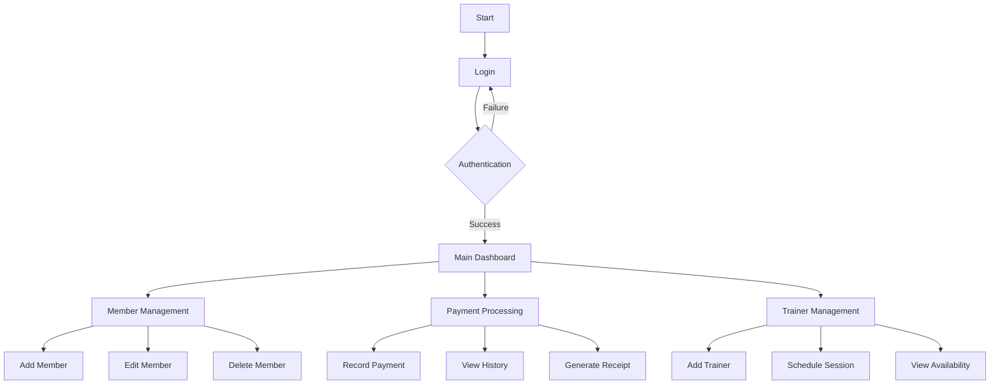

The GMS (Gym Management System) project is the software program that tracks, maintains, and manages all the member and staff data, entirely constructed at the administrative level, only the administration has access, it was developed in Java Programming using NetBeansIDE, JFrame, and MySQL Database. That project will assist gym managers to manage their customers, and staffs. 

- Front-end: Friendly user-interface with Java Swing  
- Back-end: Handled by the SQL database via JDBC API to communicate with MySQL.
- Administrative level: provided username and password {admin,admin}
- Record of Member, Payment, and Trainer


# Gym Management System

A comprehensive Java-based desktop application for managing gym operations, memberships, and staff. This system helps gym administrators manage members, trainers, payments, and schedules efficiently through a user-friendly interface.

## Key Features Highlights
✨ Secure Admin Login
🏋️ Member Profile Management
💰 Payment Tracking
👥 Trainer Assignment
📊 Membership Benefits Control
📅 Session Scheduling

## Table of Contents
- [Features](#features)
- [Getting Started](#getting-started)
- [Project Structure](#project-structure)
- [Workflow](#workflow)
- [Requirements](#requirements)
- [Installation](#installation)
- [Configuration](#configuration)
- [Database Setup](#database-setup)
- [Running the Application](#running-the-application)
- [Troubleshooting](#troubleshooting)
- [Development](#development)
- [Contact](#contact)

## Getting Started
Before running the application, ensure you have:
1. JDK 11+ installed
2. MySQL 8.0+ installed
3. NetBeans IDE or similar
4. Maven installed

## Features
- Member Management
  - Add/Edit/Delete members
  - Track membership status
  - Manage membership benefits
- Payment Processing
  - Record payments
  - Track payment history
  - Generate receipts
- Trainer Management
  - Assign trainers
  - Schedule training sessions
  - Track trainer availability
- Administrative Controls
  - Secure login system
  - User management
  - System settings

## Project Structure
```
gym-management-system/
├── src/
│   └── main/
│       ├── java/
│       │   └── com/
│       │       └── mycompany/
│       │           └── gymmanagementsystem/
│       │               ├── controller/
│       │               │   ├── MembershipController.java
│       │               │   ├── PaymentController.java
│       │               │   └── TrainerController.java
│       │               ├── model/
│       │               │   ├── Membership.java
│       │               │   ├── Payment.java
│       │               │   └── Trainer.java
│       │               ├── view/
│       │               │   ├── BenefitsPanel.java
│       │               │   ├── LoginFrame.java
│       │               │   └── MainFrame.java
│       │               └── util/
│       │                   └── DatabaseConnection.java
│       └── resources/
│           ├── images/
│           └── config.properties
├── database/
│   └── gym_db.sql
└── README1.md
```

## Workflow



## Requirements
- Java JDK 11 or higher
- MySQL 8.0 or higher
- NetBeans IDE (recommended)
- Maven (for dependency management)

## Installation
1. Clone the repository:
```bash
git clone https://github.com/sajal/gym-management-system.git
```

2. Install dependencies:
```bash
cd gym-management-system
mvn install
```

## Configuration
Create a `config.properties` file in `src/main/resources/` with:
```properties
db.url=jdbc:mysql://localhost:3306/gym_db
db.user=your_username
db.password=your_password
```

## Database Setup
1. Install MySQL Server
2. Create a new database:
```sql
CREATE DATABASE gym_db;
```
3. Import the database schema:
```bash
mysql -u root -p gym_db < database/gym_db.sql
```

## Running the Application
1. Configure database connection in `src/main/resources/config.properties`
2. Run the application using NetBeans IDE or command line:
```bash
mvn exec:java -Dexec.mainClass="com.mycompany.gymmanagementsystem.GymManagementSystem"
```

Default login credentials:
- Username: admin
- Password: admin

## Troubleshooting
Common issues and solutions:
1. Database Connection Failed
   - Check MySQL service is running
   - Verify database credentials
2. Compilation Errors
   - Ensure JDK 11+ is installed
   - Run `mvn clean install`

## Development
To contribute to this project:
1. Fork the repository
2. Create your feature branch
3. Commit your changes
4. Push to the branch
5. Create a Pull Request

## System Architecture
- Frontend: Java Swing for GUI
- Backend: Java core with MySQL database
- Pattern: MVC (Model-View-Controller)
- Database: MySQL with JDBC connection

## Dependencies
```xml
<dependencies>
    <dependency>
        <groupId>mysql</groupId>
        <artifactId>mysql-connector-java</artifactId>
        <version>8.0.33</version>
    </dependency>
    <dependency>
        <groupId>org.jdatepicker</groupId>
        <artifactId>jdatepicker</artifactId>
        <version>1.3.4</version>
    </dependency>
</dependencies>
```

## Contact
- Developer: Sajal
- Email: sajalkumar1765@gmail.com

## Copyright
© 2024 Sajal. All rights reserved.

## System Requirements
- Operating System: Windows 10+/macOS/Linux
- Memory: Minimum 4GB RAM
- Storage: 500MB free space
- Display: 1280x720 minimum resolution 

## Security
- Change default admin credentials after first login
- Use strong passwords for database
- Regular backup recommended
- Keep MySQL and Java updated 

## Logging
Application logs are stored in:
- Windows: C:\ProgramData\GymManagement\logs
- Linux/Mac: /var/log/gymmgmt/ # GYM_LOG_APP_2
